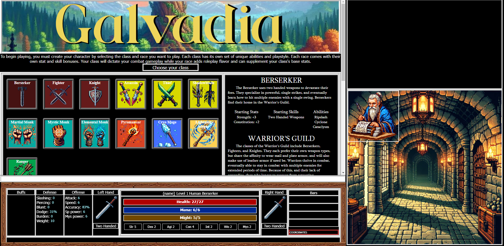

# Galvadia
  

  
## About
Galvadia is an immersive, text-based RPG that draws inspiration from classic MUD (Multi-User Dungeon) games, like Legends of Terris, where players explore an open world while completing quests and fighting their way through enemies. It offers dynamic gameplay through its class and skills system and real-time combat mechanics.

### Disclaimer
Galvadia started off as a tool for teaching myself how to code, therefore, it contains extremely messy and unmaintainable code, and does not represent how I would structure my code today. The codebase contains a mix of code that I've written from day 1 til ~a few months ago (with little to no code refactoring).

The game is very much in development. The tutorial is playable. Once I iron out a stable early-game playthrough, I will be working to balance mechanics like weapon damage, armor effectiveness, skill and ability scaling, etc. Those mechanics exist and are already somewhat stable, but there might be some inconsistencies or over/under powered aspects that I haven't tuned up/down yet. The game start is not set up how I would like it to be for a clean experience as doing so would make it more difficult to quickly reload the game to test things out.

All that being said, it does have playable and in-depth content, particularly the leveling and combat. Only recently did I get most of the groundwork laid for scaling the game larger, so once I get the tutorial complete with an instruction manual to include in the files, I'll be building the game out and making it more stable.

## Table of Contents
- [Installation](#installation)
- [Features](#features)
- [Technologies Used](#technologies-used)

## Installation

1. Download 

## Features

KEY FEATURES
- Players can choose from 13 classes (each unique in their playstyle)
- Players can choose from 11 races
- A variety of rewarding quests
- Weapon, armor, and item shops
- Interactive NPCs (quests and dialogue)
- Item enhancement system
- Skill and ability progression by gaining and spending Skill Points
- Immersive combat

** Mystic Monk and Elemental Monk need to be reworked/adjusted. I don't think they have any game breaking bugs, just maybe some scaling issues and wonky ability mechanics (mainly the Elemental Monk). Feel free to choose them though if you want to test them out **
GETTING STARTED
1. Launch the game by opening the .html file in a browser
2. Select your class and race by clicking on the class/race icons
3. The screen will scroll down on class select. Ignore that and the weapon wielding text you see at the bottom. 
4. Name your character
5. Click the confirm character button
6. Follow the in-game tutorial

Saving isn't completely ironed out yet, and likely still has bugs. 
SAVING YOUR GAME
To save the game, type "save" followed by the name you want to give the save file. There is no way to overwrite a save file, so you will have to save to a new file each time you want to save the game. Your file will be saved as a .json file.

LOADING YOUR GAME
To load a game, type "load" and an open file window will appear. Just select the save file you want to load.
  
## Technologies Used

### Languages
1. JavaScript (vanilla)
2. HTML
3. CSS (exclusively custom)

